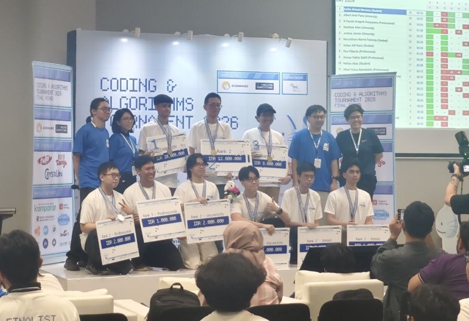
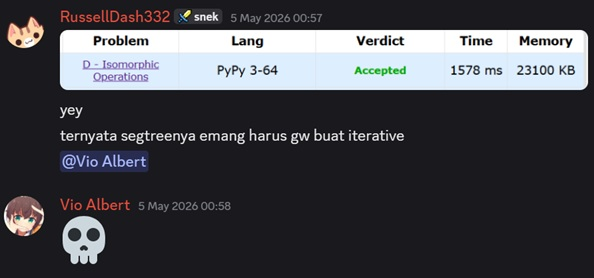
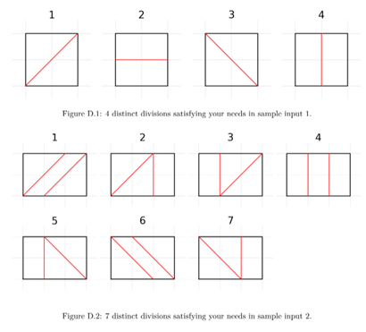
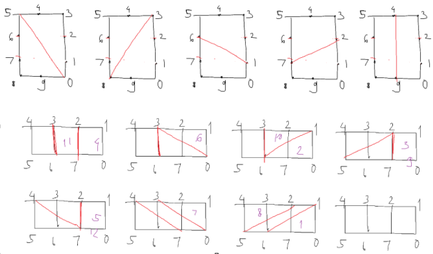
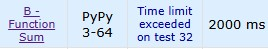

# My favorite problem from every round in CAT2026
14 June 2026

[tag]: competitive-programming, python

Coding and Algorithms Tournament 2026 has finally come to a wonderful conclusion! Congratulations to all the winners, and good job to the organizing committee for pioneering such a well-executed event!

<figure style="display: flex; justify-content: center; align-items: stretch; gap: 10px; width: 80%; margin: 0 auto;">
    
    
</figure>

For those who don't know yet, the competition, or CAT2026 for short, is held by Ecommurz x CSRelatedCompetitions to engage Indonesian people all around the world, not necessarily students, to participate and experience being in a competitive programming event, which makes it a first competitive programming competition (or at least after a long while) that includes professionals as well. More information can be found [on their website](https://catournament.org).

I'm thankful to be part of the committee, specifically on handling the livestream for preliminary batch 2, semifinal, and the onsite final round itself. It was very fun doing live coverage again after the last gig on ICPC APAC 2025 :)

<figure style="text-align: center;">
    
    <figcaption><i>First interview segment during the 7-hour livestream</i></figcaption>
</figure>

As a monthly article, I thought I'd like to share my favorite problem from each round from the preliminary batches all the way down to the final round. Note that I'm attempting to solve all the problems **in Python**. That's where I feel some problems can be very challenging.

## Preliminary Batch 1: Problem C

The abridged problem statement is this. You can also find the official problem statement in [this Codeforces mirror contest](https://codeforces.com/gym/106506/problem/C).

> You have $N$ objects to be put into $M$ buckets, with the constraint that bucket $i$ has exactly $A_i$ objects. You can construct a $N \times N$ symmetric matrix of positive integers called $T$ such that if two objects $i, j$ are together, you will get a score of $T_{i, j}$. Your final score for a single arrangement is the sum of the scores for every two unordered pairs of objects put into the same bucket. For any fixed $T$, what is the maximum number of distinct final scores across all arrangements of the $N$ objects?

When I first saw this, I instantly sensed that the $T$, which was a free variable, was there just for the show and messing you up for seeing such a long question. You can pick a nice matrix $T$ such that any different arrangement will possibly yield a unique total score. So, let's assume there exists such $T$ and then deal with it later.

So, the idea is that you want to make use of combinatorics when it comes to assigning items to buckets. Initially, using the formula for dividing $N$ objects to $A_1, A_2, \cdots, A_M$ objects, the answer would be $$\frac{N!}{A_1!A_2! \cdots A_M!}$$

However, for two buckets with the same size, say $A_i = A_j$, if you swap the assignments of all the objects in these two buckets, the final score would remain the same. Therefore, we have to settle the symmetry by listing out the frequency of buckets with every size. Suppose the number of buckets with size $k$ is $S_k$, then you have to divide the answer with $S_k!$. However, you should not divide by $S_0!$ as there are no objects being reshuffled in this instance. Therefore, the final answer should be $$\frac{N!}{\prod_{i=1}^M A_i!\prod_{k=1}^{N}S_k!}$$

To compute the factorials efficiently, you have to precompute the values, as well as their inverses modulo $998244353$. One way to precompute the factorial in Python is as such.

```python
LIMIT = 10**6
MOD = 998244353
fact = [1, 1]
for i in range(2, LIMIT+1):
    fact.append(fact[-1] * i % MOD)
```

You might think that the inverse modulo of each factorial can simply be computed by just taking the inverse modulo of each value in the `fact` array, but this is actually slow since it takes $O(N \log N)$ time in total (one inverse modulo takes logarithmic time).

```python
inv = [pow(f, -1, MOD) for f in fact]
```

However, we can speed this up to make the whole thing run in just $O(N)$ time. Note that we can start from $\text{inv}(N!)$ and then bubble up to $\text{inv}(0!)$ like how we precompute `fact` because $\text{inv}((k-1)!) = \text{inv}(k!) \times k$.

As a result, our `inv` array will contain $[\text{inv}(N!), \text{inv}((N-1)!), \cdots, \text{inv}(1!), \text{inv}(0!)]$ so we can just reverse it in the end to obtain the final inverse modulo array.

```python
inv = [pow(fact[LIMIT], -1, MOD)]
for i in range(LIMIT, 0, -1):
    inv.append(inv[-1] * i % MOD)
inv = inv[::-1]
```

When you combine the precomputation into a single Python line of code, it goes like this. Here, I assume I would take an input integer $N$.

<div class="aocgolf">

```python
M=998244353;N=int(input());F=[f:=1]+[f:=f*-~i%M for i in range(N)];I=([f:=pow(f,-1,M)]+[f:=f*(N-i)%M for i in range(N)])[::-1]
```

</div>

Now, back to the existence of such $T$, shortly after the contest, I realized that $T_{i, j} = 2^{2^i+2^j}$ should work. Note that $2^i+2^j$ is unique for any two unordered pair of indices $i \neq j$, but I can still have two different instances of two pairs to sum up the same, e.g. $(2^1+2^3)+(2^2+2^4) = (2^1+2^4)+(2^2+2^3)$. To address this, I can simply make it the power of $2$ to signify the uniqueness, e.g. from the previous example we can see that $2^{2^1+2^3}+2^{2^2+2^4} \neq 2^{2^1+2^4}+2^{2^2+2^3}$. This completes my full solution.

> The official editorial uses $2^{\max(i-1, j-1) \times N + \min(i-1, j-1)}$. Oh well, close enough.

I was coding **on phone** [in Japan](https://russelldash332.github.io/posts/japan-trip-2026.html) when this round happened so I thought like a madman "why not golf it?". Below is my final code for the problem. Don't worry, this is the only round where I try to golf my solutions.

<div class="aocgolf">

```python
from collections import*;N,M,*A=map(int,open(S:=0).read().split());X=998244353;F=[f:=1]+[f:=f*-~i%X for i in range(N)];I=([f:=pow(f,-1,X)]+[f:=f*(N-i)%X for i in range(N)])[::-1];Z=F[N]
for i in A:Z=Z*I[i]%X
for k,i in Counter(A).items():
 if k:Z=Z*I[i]%X
print(Z)
```

</div>

First line is to get the input and precompute the factorials and their inverse modulo.
Second line is to apply the denominator from the original formula.
Third and fourth lines are to deal with the symmetry.
Final line to print the solution.
The overall complexity is $O(N)$. Yay!

## Preliminary Batch 2: Problem D

The abridged problem statement is this. You can also find the official problem statement in [this Codeforces mirror contest](https://codeforces.com/gym/106515/problem/D).

> You start with a string $S$ of length $N$, each character is either one of the first four letters of the alphabet ($a, b, c, d$). You have $Q$ operations to perform on the string and each operation is one of the three: either change the character on a particular index ($S_u = x$); cyclic-shift all characters in an interval $[l, r]$ ($abcd \rightarrow bcda$); or determine if given $l, r, p$ the string $S_{l .. l+p-1}$ is **isomorphic** to the string $S_{r .. r+p-1}$. Two strings $X$ and $Y$ are isomorphic if for every pair of indices $i, j$, we have $X_i = X_j \iff Y_i = Y_j$, e.g. $abba$ and $dccd$ are isomorphic.

When I was livestreaming this round, I was surprised: **we're expecting a range query question this early in the preliminary round?** I did not fully solve it during the contest time, but few days after the contest I managed to pull it off. I enjoyed working on this problem because I get to reflect back on my template segment tree methods (both [general](https://github.com/RussellDash332/pytils/blob/main/segment_tree_general.py) and [dynamic](https://github.com/RussellDash332/pytils/blob/main/segment_tree_dynamic.py)) that I have been using on Kattis since who knows when, and the overall solution to this problem was just mindblowing to me.

The initial idea here is to cleverly **hash** the string and subsequently its substrings efficiently as the modification query comes. Using [polynomial hashing](https://github.com/RussellDash332/pytils/blob/main/string_hashing.py), we can easily modify the hash when one character is modified (operation 1) and when we have to query the two strings in operation 3, but checking isomorphism might take more effort since the hash of `'abba'` and `'cddc'` can be very different and therefore hard to tell by just the single hash value.

Instead, let's look at the original string as a collection of **4 binary strings** that we can later hash, one for each letter and for every indices it is $1$ if it matches the character and $0$ otherwise, so `'abba'` can be represented as $[1001, 0110, 0000, 0000]$ and `'dcab'` will be mapped to $[0010, 0001, 0100, 1000]$. Now, we can easily query the isomorphism by checking if both sorted versions of the 4 binary string hashes are equal. Now, we have both operation 1 and 3 sorted, but not operation 2: the range cyclic shift.

How do we handle the range cyclic shift? One could easily use a data structure that supports range addition like Fenwick trees or segment trees to store how much (modulo 4) a particular index has shifted. But modifying the actual hash just like that will not be so easy now since the interval that we're shifting might consist of different characters.

Therefore, we can make use of segment tree where for any interval $[l, r]$ we store the hash of $S_{l..r}$ using the 4-binary string trick, say the hashes are $h_A, h_B, h_C, h_D$. A single cyclic shift of step 1 will simply modify the list to $h_D, h_A, h_B, h_C$ because the old $h_D$ is the new $h_A$, the old $h_A$ is the new $h_B$, and so on.

We also need to store the length of the string constructed so far so we can combine the hashes of two halves properly when going back up from the recursion (foreshadowing: *or is it recursion*?). For example, if left side has $h_A = x$ and length $m$, right side has $h_A = y$ and length $n$, we can combine them into a string with length $m+n$ and hash $h_A = x \cdot p^n + y$.

In my solution, I used Fenwick tree to store how much I have shifted a particular character (with careful consideration of operation 1), but as of writing this I realized I could integrate this within the segment tree as well, so the solution is slightly longer than it could've been.

**In summary**, what you have to do is store the hash of the original string as the four hashes of the binary strings in a segment tree.

1. Changing an index $k$ from $x$ to $y$ is basically a cyclic shift of step $(y-x) \pmod 4$ on interval $[k, k]$.
2. The range cyclic shift on $[l, r]$ is basically a cyclic shift of step $1$ on interval $[l, r]$.
3. You can query the four hashes of $[l, l+p-1]$ and $[r, r+p-1]$ and then check if both sorted versions are equal.

With this general blueprint, I started off with setting `S = 'aaa...aa'`, so the hash on each segment is easier to compute using geometric series. After that, I started to modify the characters accordingly one by one so the segment tree remained consistent. Finally, the $Q$ operations in action.

<figure style="text-align: center;">
    
    <figcaption><i>lmao fluke</i></figcaption>
</figure>

The Python solution was very tight because initially it TLE'd, but I have to basically "lobotomize" most segment tree functions by making it iterative instead of recursive. This should not be a problem at all if you're using C++, and therefore makes the Python-only challenge a crazy tough one.

```python
import sys; input = sys.stdin.readline; from collections import *
class FenwickTree:
    def __init__(self, arr):
        self.ft = [0]*(len(arr)+1)
        self.n = len(arr)
        for i in range(self.n): self.add(i, i+1, arr[i])
    def _add(self, idx, e):
        idx += 1
        while idx <= self.n: self.ft[idx] += e; idx += idx&(-idx)
    def add(self, l, r, e): # a[l:r] += e
        self._add(l, e); self._add(min(r, self.n), -e)
    def get(self, idx): # a[idx]
        s, idx = 0, min(idx+1, self.n)
        while idx > 0: s += self.ft[idx]; idx -= idx&(-idx)
        return s
from array import *
L = array('I')
R = array('I')
LC = array('i')
RC = array('i')
Z = array('B')
HA = array('I')
HB = array('I')
HC = array('I')
HD = array('I')
HS = array('I')
def create(l, r): L.append(l); R.append(r); LC.append(-1); RC.append(-1); Z.append(0); HA.append(G[r-l+1]); HB.append(0); HC.append(0); HD.append(0); HS.append(r-l+1); return len(L)-1
def push(s):
    if L[s] == R[s]: return
    mi = (L[s]+R[s])//2
    if LC[s] < 0: LC[s] = create(L[s], mi); RC[s] = create(mi+1, R[s])
    lc = LC[s]; rc = RC[s]
    if Z[s] == 1: HA[lc], HB[lc], HC[lc], HD[lc] = HD[lc], HA[lc], HB[lc], HC[lc]; HA[rc], HB[rc], HC[rc], HD[rc] = HD[rc], HA[rc], HB[rc], HC[rc]
    elif Z[s] == 2: HA[lc], HB[lc], HC[lc], HD[lc] = HC[lc], HD[lc], HA[lc], HB[lc]; HA[rc], HB[rc], HC[rc], HD[rc] = HC[rc], HD[rc], HA[rc], HB[rc]
    elif Z[s] == 3: HA[lc], HB[lc], HC[lc], HD[lc] = HB[lc], HC[lc], HD[lc], HA[lc]; HA[rc], HB[rc], HC[rc], HD[rc] = HB[rc], HC[rc], HD[rc], HA[rc]
    Z[lc] += Z[s]; Z[lc] %= 4; Z[rc] += Z[s]; Z[rc] %= 4; Z[s] = 0
def add(s, lq, rq, v):
    stk = [(s, 0)]
    while stk:
        u, b = stk.pop()
        if b == 0:
            if L[u] > rq or R[u] < lq: continue
            push(u)
            if L[u] >= lq and R[u] <= rq:
                if v == 1: HA[u], HB[u], HC[u], HD[u] = HD[u], HA[u], HB[u], HC[u]
                elif v == 2: HA[u], HB[u], HC[u], HD[u] = HC[u], HD[u], HA[u], HB[u]
                elif v == 3: HA[u], HB[u], HC[u], HD[u] = HB[u], HC[u], HD[u], HA[u]
                Z[u] = (Z[u]+v)%4
                continue
            stk.append((u, 1)); stk.append((RC[u], 0)); stk.append((LC[u], 0))
        else: lc = LC[u]; rc = RC[u]; e = P[bn:=HS[rc]]; an = HS[lc]; HA[u] = (HA[lc]*e+HA[rc])%M; HB[u] = (HB[lc]*e+HB[rc])%M; HC[u] = (HC[lc]*e+HC[rc])%M; HD[u] = (HD[lc]*e+HD[rc])%M; HS[u] = an+bn
def get(s, lq, rq):
    stk = [s]; za = zb = zc = zd = 0
    while stk:
        cur = stk.pop()
        if L[cur] > rq or R[cur] < lq: continue
        if L[cur] >= lq and R[cur] <= rq: e = P[ds:=HS[cur]]; za = (za*e+HA[cur])%M; zb = (zb*e+HB[cur])%M; zc = (zc*e+HC[cur])%M; zd = (zd*e+HD[cur])%M; continue
        push(cur)
        stk.append(RC[cur])
        stk.append(LC[cur])
    return (za, zb, zc, zd)
N, Q = map(int, input().split())
S = array('b', [ord(x)-97 for x in input()])
M = 10**9+7
P = array('I', [1]); I = pow(66, -1, M)
for _ in range(N): P.append(P[-1]*67%M)
G = array('I', [(P[i]-1)*I%M for i in range(len(P))])
st = create(0, N-1)
for i in range(N):
    if S[i]: add(st, i, i, S[i])
ft = FenwickTree(S)
ZZ = []
for _ in range(Q):
    k, *v = input().split(); k = int(k)
    if k == 1:
        u, c = v; u = int(u)-1; shift = (ord(c)-97-ft.get(u))%4
        if shift: add(st, u, u, shift); ft.add(u, u+1, shift)
    elif k == 2: l, r = map(int, v); l -= 1; r -= 1; ft.add(l, r+1, 1); add(st, l, r, 1)
    else:
        l, r, p = map(int, v); l -= 1; r -= 1
        if sorted(get(st, l, l+p-1)) == sorted(get(st, r, r+p-1)): ZZ.append('YA')
        else: ZZ.append('TIDAK')
sys.stdout.write('\n'.join(ZZ))
```

The overall complexity should be $O((N+Q) \log N)$ since the time it takes to set up the segment tree is $O(N \log N)$ and then $O(Q \log N)$ to deal with the $Q$ operations, just with a constant factor due to sorting of two arrays of length 4 over and over. I did a sneaky 67 there :)

Alternatively, you can just use a treap... (Benedict, if you're reading this, send help)

## Semifinal: Problem D

The abridged problem statement is this. You can also find the official problem statement in [this Codeforces mirror contest](https://codeforces.com/gym/106530/problem/D).

> Suppose you have a rectangle in the 2D coordinate system with its vertices at $(0, 0), (0, M), (N, 0), (N, M)$. You want to cut the rectangle into $K$ polygons using $K-1$ segments such that each polygon has the same area; all segments do not intersect with each other except possibly at their endpoints; and all segment endpoints must have integer $x$ and $y$ coordinates, i.e. lattices. You want to find how many different ways to perform such division. Two divisions are different if at least one of the dividing segments are different.

<figure style="text-align: center;">
    
    <figcaption><i>taken from sample input, I think I needed to make this clear for you guys</i></figcaption>
</figure>

Before I begin, I hope this summarizes the proof from the official editorial that for any valid division, you cannot have a polygon with at least 3 of the sides **not** being the side of the rectangle. This is important for the actual solution.

Suppose such polygon exists. This polygon will contain at least 3 vertices at distinct sides of the rectangle, say $P, Q, R$. Therefore, $\triangle PQR$ will be contained within this polygon.

Without loss of generality, assume the two points on the opposing sides of the rectangle are $P$ and $R$, then $PR$ will divide the rectangle into two right trapezoids, with one of them containing $Q$ at its altitude. It can be proven algebraically that the area of $\triangle PQR$ is always larger than the other triangles formed by $PQ$ and $QR$.

This means our original polygon has an even bigger area than that of $\triangle PQR$, and there could be even smaller polygons formed by further dividing the two triangles formed by $PQ$ and $QR$ due to the presence of other segments. Therefore, the division can never be valid since the area of some polygons can never be equal.

With the above claim having been proven, I can simplify how I define by divided polygons. For a rectangle of size $N \times M$, I can rename every lattice point along the sides starting from $(N, 0)$ as ID $0$, point $(N, M)$ as $M$, point $(0, M)$ as $N+M$, and $(0, 0)$ as $N+2M$. Then, for every pair of quadrant ($\binom{4}{2} = 6$ of them), I precomputed the *clockwise* areas when the segment connects point $x$ and point $y$.

Here, the clockwise area of a segment $\vec{lr}$ is the set of all points $p$ in the rectangle such that $\vec{lr}$ can be rotated clockwise with respect to $l$ for an angle less than $\pi$ radians to have the same direction as $\vec{lp}$. Taking the first rectangle from the example below, the clockwise area of $\vec{v_0v_5}$ would be the region containing points $1, 2, 3, 4$.

<figure style="text-align: center;">
    
    <figcaption><i>like this!</i></figcaption>
</figure>

There are a few ways to optimize the area precomputation, and the Python code already shows it.

- Only consider areas that are in form of $\frac{iNM}{K}$, where $i$ is a positive integer.
- If $\vec{v_iv_j}$ has a clockwise area of $\frac{kNM}{K}$, then $\vec{v_jv_i}$ will have a clockwise area of $\frac{(K-k)NM}{K}$.
- You don't need to consider the case when $k = 0$ or $k = K$, just everything in between.

Suppose $S_i$ are the set of all segments whose clockwise area is $\frac{iNM}{K}$. I can optimize the memory by storing $8192x+y$ instead of the tuple $(x, y)$. The usage of $8192$ is because I want to ensure that $y > x$, i.e. wrap around $2(N+M)$.

The next step is to **reformulate this problem** as the number of ways to I can select a segment from each of $S_1, S_2, \cdots, S_{K-1}$; say $s_1, s_2, \cdots s_{K-1}$; such that if $x > y$ then $s_y$ is within the clockwise area of $s_x$. The constraint $K \le 10^9$ is a red herring since we must have $K | 2NM$ to obtain a valid division and therefore $K \le 2NM \le 2 \cdot 10^6$, so we shouldn't worry about having to go through each of $S_1, S_2, \cdots, S_{K-1}$.

The transition from $S_k$ to $S_{k+1}$ is the last bottleneck, since we can't simply iterate through the cross-product of the two list. However, notice that if both lists have been sorted beforehand, we can use a two-pointer technique to solve this problem!

For a particular segment denoted by $(l, r>l)$, a valid segment from $S_{k+1}$ would be a segment $(l', r'>l')$ such that $l \le [l' < r'] \le r$ (note that it is possible to have the values of both $r$ and $r'$ exceed $2(N+M)$).

It is also worth noting that we have to run the two-pointer on the $S_k$ being doubled so as to handle the wrap-around leftovers. A good test example would be the two lists below.

```python
s_1 = [(0, 3), (2, 5), (3, 6), (4, 7), (6, 9), (7, 10)]
s_2 = [(1, 6), (2, 7), (3, 8), (5, 10), (6, 11), (7, 12)]
```

Suppose we're not doubling `s_1`, then this will happen.

- $(1, 6)$ will capture $(2, 5)$ and $(3, 6)$
- $(2, 7)$ will capture $(2, 5)$, $(3, 6)$, and $(4, 7)$
- $(3, 8)$ will capture $(3, 6)$ and $(4, 7)$
- $(5, 10)$ will capture $(6, 9)$ and $(7, 10)$
- $(6, 11)$ will capture $(6, 9)$ and $(7, 10)$, but notice it could've captured $(0, 3)$
- $(7, 12)$ will capture $(7, 10)$, but notice it could've captured $(0, 3)$

Doubling the array will result in the two extra captures to be detected, but at the cost of double-counting everything exactly twice. So, using the same example above we have

```python
s_1 = [(0, 3), (2, 5), (3, 6), (4, 7), (6, 9), (7, 10)] + [(8, 11), (10, 13), (11, 14), (12, 15), (14, 17), (15, 18)]
s_2 = [(1, 6), (2, 7), (3, 8), (5, 10), (6, 11), (7, 12)]
```

Now, this will happen.

- $(1, 6)$ will capture $(2, 5)$ and $(3, 6)$
- $(2, 7)$ will capture $(2, 5)$, $(3, 6)$, and $(4, 7)$
- $(3, 8)$ will capture $(3, 6)$ and $(4, 7)$
- $(5, 10)$ will capture $(6, 9)$ and $(7, 10)$
- $(6, 11)$ will capture $(6, 9)$, $(7, 10)$, and $(8, 11)$
- $(7, 12)$ will capture $(7, 10)$ and $(8, 11)$

We resolve the double count because we can have the sequence selected segments from $S_1$ to $S_{K-1}$, $$s_{i_1 j_1}, s_{i_2 j_2}, \cdots, s_{i_{K-1} j_{K-1}}$$ and $$s_{j_{K-1} i_{K-1}}, s_{j_{K-2} i_{K-2}}, \cdots, s_{j_1 i_1}$$ as two separate counts but actually representing the exact same division. We simply divide the answer by 2 later.

The last piece of the puzzle is to nicely set up the DP transition, starting from just $S_1$ where there is only 1 way to select sequence of segments up to $S_1$, then $S_k$ where we start using the DP values from $S_{k-1}$, all the way up to $S_{K-1}$. In the end, the final DP table for each segment $z$ will consist of the number of ways to select the valid sequence of $K-1$ segments such that $s_{K-1} = z$, so the final answer is $\frac{1}{2}\sum_{s \in S_{K-1}} \text{dp}(s)$.

Finally, after handling edge cases like $K = 1$, existence of empty $S_i$ for some $1 \le i < K$, or $K$ not dividing $2NM$ in the first place, we're good to go! The solution was way shorter than I expected as this was the last question of the round and I was *lowkey* traumatized by the problem D of the previous round :)

```python
MOD = 998244353
N, M, K = map(int, input().split())
if 2*N*M%K: print(0); exit()
if K == 1: print(1); exit()
H = N+M; Q = N+2*M; P = 2*H; S = 2*N*M; R = {}; D = S//K

def add(k, i, j):
    j += P*(i>j)
    if k not in R: R[k] = []
    R[k].append((i<<13)|j)

for i in range(0, M):
    for j in range(M, H):
        v = (M-i)*(j-M)
        if S > v > 0 == v%D: k = v//D; add(k, i, j); add(K-k, j, i)
    for j in range(H, Q):
        v = (j-i-N)*N # j-N-M + M-i
        if S > v > 0 == v%D: k = v//D; add(k, i, j); add(K-k, j, i)
    for j in range(Q, P):
        v = S-(P-j)*i
        if S > v > 0 == v%D: k = v//D; add(k, i, j); add(K-k, j, i)
for i in range(M, H):
    for j in range(H, Q):
        v = (H-i)*(j-H)
        if S > v > 0 == v%D: k = v//D; add(k, i, j); add(K-k, j, i)
    for j in range(Q, P):
        v = (j-i-M)*M # M+N-i + j-2*M-N
        if S > v > 0 == v%D: k = v//D; add(k, i, j); add(K-k, j, i)
for i in range(H, Q):
    for j in range(Q, P):
        v = (Q-i)*(j-Q)
        if S > v > 0 == v%D: k = v//D; add(k, i, j); add(K-k, j, i)

for r in R: R[r].sort()
if len(R) != K-1: print(0); exit()
Z = [1]*len(R[1])
for i in range(2, K):
    p = q = pp = qq = 0; A = R[i-1]; z = []; B = len(A)
    for lr in R[i]:
        l = lr>>13; r = lr&8191
        while p < 2*B and (A[p%B]>>13)+P*(p>=B) < l: pp += Z[p%B]; p += 1
        while q < 2*B and (A[q%B]&8191)+P*(q>=B) <= r: qq += Z[q%B]; q += 1
        z.append((qq-pp)%MOD)
    Z = z
print(sum(Z)*pow(2, -1, MOD)%MOD)
```

There should be at most $O((M+N)^2)$ segments to be considered during the area computation, and the two-pointer approach will traverse each segment at most thrice, so the overall time complexity is still $O((M+N)^2)$. While there are $O(K)$ different groups in the mapping, the total number of the segments across each group dominates the $O(K)$ term.

## Final: Problem B

The abridged problem statement is this. You can also find the official problem statement in [this Codeforces mirror contest](https://codeforces.com/gym/106556/problem/B).

> Find $\sum_{x=1}^N x^P \cdot E^x \pmod M$ for a fixed value of $N, M, P, E$.

It's a very short problem statement, yet you will probably think of brute-forcing it at first. Well, don't.

<figure style="text-align: center;">
    
    <figcaption><i>just don't</i></figcaption>
</figure>

During the livestream, I was thinking of using [Faulhaber's formula](https://en.wikipedia.org/wiki/Faulhaber%27s_formula) to resolve the power sum, but I realize it's not enough as I still have $N$ terms decomposed in a different way, so clearly I can't just bash a freaky formula to end this once and for all. Another problem is that I cannot use inverse modulo since $M$ is not always a prime number!

Turns out, what I was missing is the need for **divide-and-conquer**! You can start by denoting the sum as $S_N$, so what I have to do express $S_N$ in terms of something like $S_{\frac{N}{2}}$, and we can resolve the issue when $N$ is odd pretty easily.

If $N$ if odd, we can agree that we can simply apply the transition $S_{N} = S_{N-1} + N^P \cdot E^N$. However, the fun part comes when $N$ is even, say $N = 2k$.

Note that using the binomial theorem,

$$
\begin{align*}
S_{2k} &= (1^P \cdot E^1 + 2^P \cdot E^2 + \cdots + k^P \cdot E^k) + ((1+k)^P \cdot E^{1+k} + (2+k)^P \cdot E^{2+k} + \cdots + (k+k)^P \cdot E^{k+k}) \\
&= S_k + ((1+k)^P \cdot E^{1+k} + (2+k)^P \cdot E^{2+k} + \cdots + (k+k)^P \cdot E^{k+k}) \\
&= S_k + E^k \sum_{i=1}^k (i+k)^P \cdot E^i \\
&= S_k + E^k \sum_{i=1}^k \sum_{r=0}^P \binom{P}{r} i^r k^{P-r} E^i \\
&= S_k + E^k \sum_{r=0}^P \sum_{i=1}^k \binom{P}{r} i^r k^{P-r} E^i \\
&= S_k + E^k \sum_{r=0}^P \left\( \binom{P}{r} k^{P-r} \cdot \sum_{i=1}^k i^r E^i \right\)
\end{align*}
$$

The inner summation is very similar to $S_k$, but the power is $r$ instead of $P$, so this suggests us to redefine the original problem, not just in terms of how many terms to sum, but also what is the power being used, meaning the original problem can be denoted as $D_{N,P}$, and we can reformulate the summation as so.

$$
\begin{align*}
S_{2k} &= S_k + E^k \sum_{r=0}^P \left\( \binom{P}{r} k^{P-r} \cdot \sum_{i=1}^k i^r E^i \right\) \\
D_{2k,P} &= D_{k,P} + E^k \sum_{r=0}^P \binom{P}{r} k^{P-r} D_{k,r}
\end{align*}
$$

We can precompute $\binom{P}{r}$ in $O(P^2)$ time using the Pascal triangle to avoid integer division. The rest needs to be computed right when the recursion is being run, as the term $k^{P-r}$ depends on the value of $k$ the current function is running. As long as we can reduce the common operations like assigning $E^k$ to a variable before using it $P$ times and computing $k^r$ for all $0 \le r \le P$ in total $O(P)$ time instead of $O(P \log P)$ should be able to resolve the possible TLE issue when you're working on this problem with Python.

The DP table itself should have at $O(\log N)$ distinct values of $k$ and thus its size is $O(P \log N)$. Given the tips above, we can compute the summation $D_{2k,P}$ in $O(P)$ time assuming the inner $D$ values have been cached, resulting in an overall time complexity of $O(P^2 \log N)$.

```python
N, M, P, E = map(int, input().split())
C = [[1]]
for i in range(P):
    C.append([1])
    for j in range(i): C[-1].append((C[-2][j]+C[-2][j+1])%M)
    C[-1].append(1)
D = {1:[E%M]*(P+1)}; N2 = N
while N2 > 1:
    D[N2] = [-1]*(P+1)
    if N2%2: N2 -= 1
    else: N2 >>= 1
for r in sorted(D):
    if r < 2: continue
    if r%2:
        e = pow(E, r, M); z = 1
        for p in range(P+1): D[r][p] = (z*e+D[r-1][p])%M; z = z*r%M
    else:
        e = pow(E, m:=r//2, M); c = [1]
        for p in range(P+1): c.append(c[-1]*m%M); D[r][p] = (D[m][p]+e*sum(C[p][i]*c[p-i]*D[m][i] for i in range(p+1)))%M
print(D[N][P])
```

That's all for now! See you in CAT2027 (manifesting), and time for me to think what to write for next month...