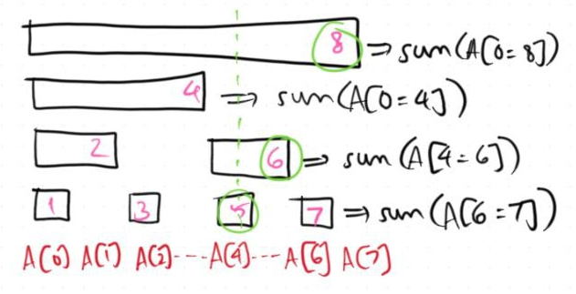
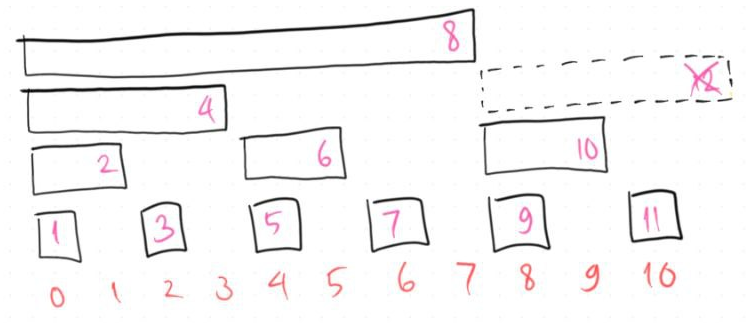
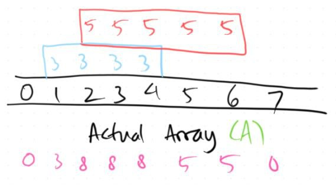
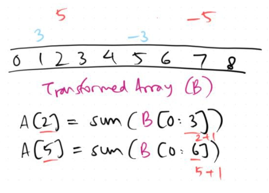
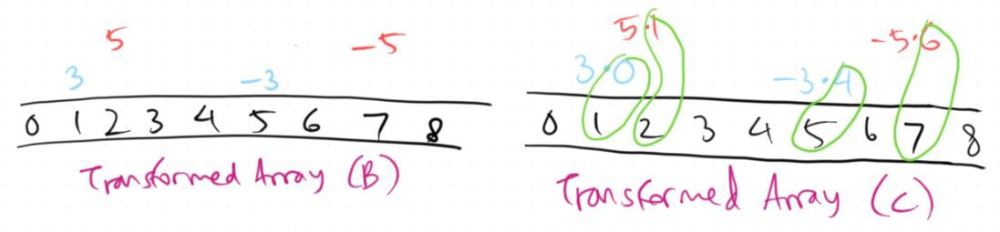

# Fenwick Trees Made Easy!
28 July 2024

[tag]: algorithms, data-structures, competitive-programming

Let's start with an array $A$ of size $N$, each entry is initially zero. Suppose that over time, I want to support these operations on the array:

1. Add all indices of $A$ in range $[l, r]$ by an integer $x$, where $0 \le l \le r < N$
2. Find the sum of $A[l..r]$, where $0 \le l \le r < N$

We can do this naively with a single for loop, right? This means each query type can be done in $O(N)$ time. However, what if I tell you that there is a data structure that can support both these operations in $O(\log N)$ time? Let me introduced you to **Fenwick trees**, also called as **binary indexed trees (BIT)**!

## Update and Query
Before we begin, let me introduce you to the concept of update and query operations. The first operation mentioned in the prologue is an update operation, whereas the second one is a query operation. On specific scenarios where it is guaranteed that $l = r$, we call these operations *point operations*, otherwise they are *range operations*. Therefore, Fenwick trees are capable of range updates (RU) and range queries (RQ), as well as point updates (PU) and point queries (PQ).

## The Classic PURQ
I would like to dive straight to the PURQ version of the Fenwick tree which is the most commonly used version.

You can also test your own implementation of the PURQ Fenwick tree on this Kattis problem: [Fenwick Tree](https://open.kattis.com/problems/fenwick).

The PURQ Fenwick tree utilizes another array (let's call this array $F$) of size $N+1$ to support 1-based indexings. The main concept of Fenwick trees is the use of least significant bits (LSBs) to indicate which indices on $F$ stores the value of a particular index on the original array.

For example, the least significant of $10$ is $2$ because $10 = (1010)_2$ and therefore the LSB here is the rightmost 1-bit which is $2$. To quickly get the LSB of $x$, we simply evaluate $x\&(-x)$, where $\&$ is the binary AND operation.

Now, how do we determine which indices of $F$ that store $A[i]$ for a particular index $i$?

- Start with $x = i+1$ (add 1 since the Fenwick tree array is 1-based)
- Repeat the following as long as $x \le N$:
    - Store $A[i]$ in $F[x]$
    - Add $x$ by the LSB of $x$

For example, suppose $N = 8$. This means $A[4]$ is stored in $F[5], F[6], F[8]$. This is because $6 = 5+LSB(5)$ and $8 = 6+LSB(6)$. For the rest of indices, do take a look at the following visualization below (indices of $F$ are in pink text).

Therefore, when adding $A[i]$ by some integer $x$, we simply do the same to all the indices of $F$ that stores $A[i]$.

As for the range query for $A[l..r]$, let's start with querying the prefix sum, meaning $l = 0$. Similarly, we also make use of the LSB of $r+1$, but instead of adding it until it exceeds $N$, we keep subtracting until it becomes $0$.

For example, we want to query the sum of $A[0..5]$, so we start with $x = 5+1 = 6$, and then we keep adding $F[x]$ to our answer and subtract $x$ by $LSB(x)$ until $x$ equals $0$. Therefore, for $r = 5$ we have $F[6]+F[4]+F[0]$ as our final answer because $4 = 6-LSB(6)$ and $0 = 4-LSB(4)$.

To wrap up, we can now generalize to any value of $l$ by subtracting the sum of $A[0..r]$ with the sum of $A[0..l-1]$.

Some of you might wonder what happens if the example $N$ isn't a power of 2, and Fenwick tree will still work in this case (image below shows the case when $N = 11$).

## Supporting RU
### RUPQ
To support range updates optimally, we have to change the structure of $F$ to some extent. Let's start with reimplementing $F$ such that it supports RUPQ first, then we can extend it to support RURQ.

We revisit the example when $N = 8$. Suppose I want to add $A[1..4]$ by $3$ and $A[2..6]$ by $5$. Our actual array $A$ should look something like this:

Let's have another array $B$ of size $N+1$. To resemble adding $A[1..4]$ by $3$, we simply add $B[1]$ by $3$ and $B[5]$ by $-3$. Similarly, we also add $B[2]$ by $5$ and $B[7]$ by $-5$. So, for every operation that adds $A[l..r]$ by $x$, we add $B[l]$ by $x$ and $B[r+1]$ by $-x$.

To answer the point query operations, we simply take the prefix sum of $B$. For example to query the value $A[2]$, we're basically querying the sum of $B[0..2]$. Therefore, for every operation that queries $A[i]$, we simply query for the sum of $B[0..i]$.

Based on the examples above, we can use a PURQ Fenwick tree on $B$ to support RUPQ on $A$. If we want to add $A[l..r]$ by $x$, we basically perform two point updates on $B$ as explained previously, while doing a point query on $A$ is basically performing a (prefix) range query on $B$.

### RURQ
And now, the extension from RUPQ to RURQ!

Given the original array $A$ and the transformed array $B$ as what we see on the RUPQ case, we add another transformed array $C$ to handle the extra terms.

Recall that for every operation that adds $A[l..r]$ by $x$, we add $B[l]$ by $x$ and $B[r+1]$ by $-x$. Now, we also add $C[l]$ by $x \cdot (l-1)$ and $C[r+1]$ by $-x \cdot r$. The rigorous explanation on why one might come up with such structure can be found in [this article by CP Algorithms](https://cp-algorithms.com/data_structures/fenwick.html#3-range-update-and-range-query).

Finally, to obtain the prefix range sum of $A$, we perform the following calculation.

$\sum_{i=0}^{r} A[i] = r \cdot \sum_{i=0}^{r} B[i] - \sum_{i=0}^{r} C[i]$

This means

$\sum_{i=l}^{r} A[i] = r \cdot \sum_{i=0}^{r} B[i] - l \cdot \sum_{i=0}^{l} B[i] - \sum_{i=l}^{r} C[i]$

In conclusion, we can use two PURQ Fenwick trees on $B$ and $C$ respectively to support RURQ on $A$. If we want to add $A[l..r]$ by $x$, we basically perform two point updates each on $B$ and $C$ as explained, while doing a range query on $A$ is basically performing TWO (prefix) range queries on $B$ and also on $C$.

## Other Binary Operations
The addition operation is not the only operation Fenwick trees can support. In fact, there are more (associative) binary operations that can be used as an example.
### XOR
The main algorithm and array structure remains the same, depending whether you need the PURQ version, the RUPQ version, or the RURQ version. The only difference is that the addition operation is changed into the binary XOR operation. So, instead of adding elements by some integer $x$, you apply XOR on these elements by $x$.

Here's a Kattis problem that you can try out using XOR Fenwick trees: [Association of Cats and Magical Lights](https://open.kattis.com/problems/magicallights).

### Min or Max
Though it is more advisable to support range operations involving minimum/maximum using segment trees, we can also perform such using Fenwick trees.

Since we can no longer use the prefix trick like the case for XOR and addition to answer range queries, we need to revamp things to some extent again. (Note that for addition and XOR, we can obtain $f(l..r)$ given $f(0..l)$ and $f(0..r)$)

We now use an array of size $2N$ instead of $N+1$, and the operations mainly involves simple bitshifts (or multiplication/division by 2) instead of computing LSBs like we used to do on the classic PURQ example.

More details can be seen at the Python code attached on **the last section of this article**.

## Limitations
Since the main data structure used on Fenwick trees are arrays, we can see that it can hold up to a limited number of elements. Realistically speaking, for programs that are timed under 1 second, you can contain at most about $10^6$ elements. To support potentially way more elements than that, I suggest using (dynamic) segment trees which Fenwick trees are a subset of.

Similarly, some operations that are not (that) binary nor associative require segment trees to implement instead of Fenwick trees. For example, the second largest element in a range.

## Python Code
I always keep my (exclusively Python) data structures and algorithms templates on this code repository: [pytils](https://github.com/RussellDash332/pytils).

Specifically for this article, here are two templates that would help:

- [Sum update/query](https://github.com/RussellDash332/pytils/blob/main/fenwick_tree_rsq.py): PURQ, RURQ
- [Min/max update/query](https://github.com/RussellDash332/pytils/blob/main/fenwick_tree_rmq.py): PURQ, RUPQ