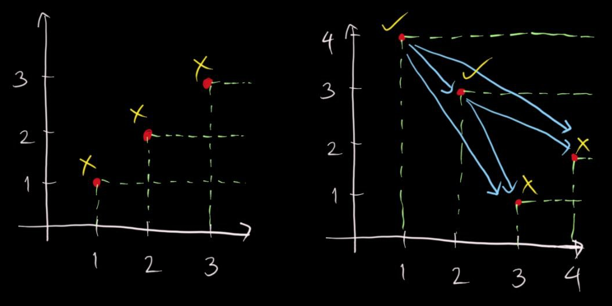
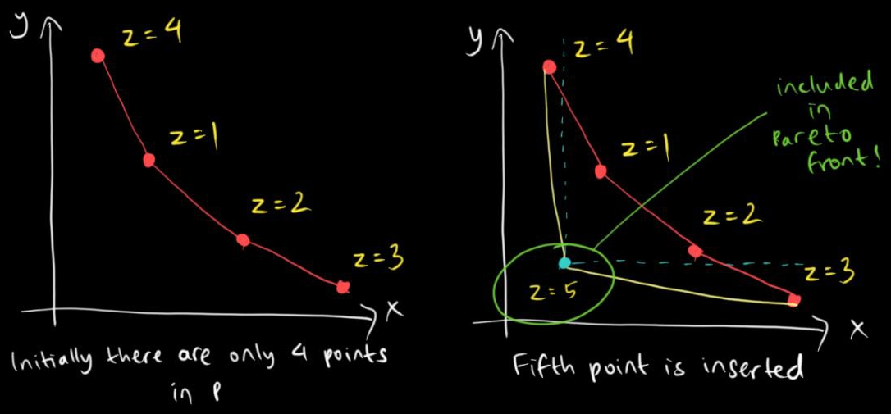
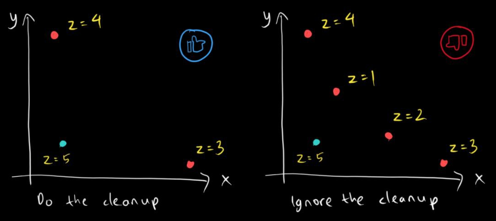
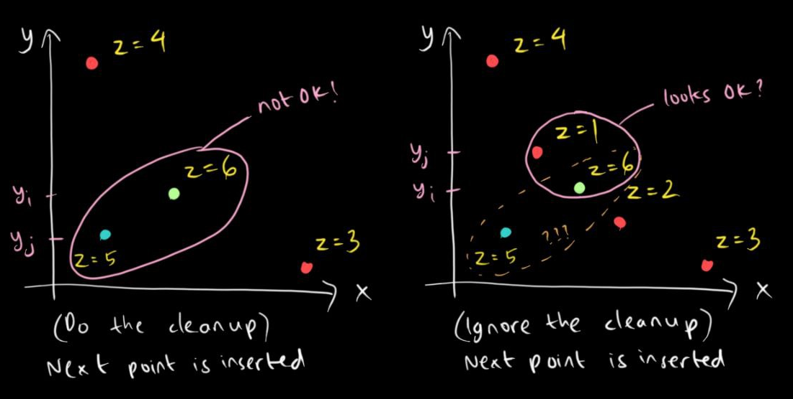

# Pareto Fronts Made Easy!
22 July 2024

[tag]: algorithms, data-structures, competitive-programming

Suppose you have a set $S$ of $N$ different objects, each object having different scores for a particular set of metrics.

Suppose we ask ourselves this question:
> How does one select as many objects as possible, say to a set $T$, such that there are **no two distinct** objects $x\in T$ and $y\in S$ where all metrics of $x$ are lower compared to $y$?

The set of objects that we want to obtain here is called a **Pareto front**. If you look at the [Wikipedia page](https://en.m.wikipedia.org/wiki/Pareto_front), this particular concept is widely used for optimizations in engineering. However, what I'll be discussing is just a small subset of it, particularly on simple objectives such as the main question above.

I'll also discuss only the case for 2 metrics and 3 metrics, respectively the 2D Pareto front and the 3D Parento front. For more than 3 metrics, it would require more sophisticated (approximation) algorithms which is out of the scope of this article.

Finally, for simplicity, we shall assume that all values within the same metric are distinct. For example, if we have two points $(x_1, y_1)$ and $(x_2, y_2)$, then $x_1 \neq x_2$ and $y_1 \neq y_2$.

## 2D Pareto Front
An example where we are to obtain a 2D Pareto front is this Kattis problem: [Physical Music](https://open.kattis.com/problems/physicalmusic).

Let me simplify the problem statement:
> There are $N$ CD singles each with their ranks on Single Top $N$ and on Download Top $N$. We want to select as many CD singles as possible such that for any CD single in this selection we can't find any other CD single with both higher rank on Single Top $N$ and lower rank on Download Top $N$. Output the complement of this selection.

Suppose we represent these CD singles as point with the ranks as coordinates in the 2D Cartesian plane ($s_i$, $d_i$). Basically the Pareto front here is the set of points such that for any point $(x, y)$ in this selection, we can't find any other point with both higher $x$-coordinate and lower $y$-coordinate.

Now let's take a look at the sample input:

- The first part has three points: $(1, 1), (2, 2), (3, 3)$. All three points lie on the Pareto front, so we output $0$.
- The second part has four points: $(1, 4), (2, 3), (3, 1), (4, 2)$. Both points $(1, 4)$ and $(2, 3)$ do not lie on the Pareto front because $(3, 1)$ and $(4, 2)$ have both higher single rank and lower download rank than $(1, 4)$ and $(2, 3)$, respectively. Therefore, we output both $(1, 4)$ and $(2, 3)$, meaning the actual output is $2$ (because there are 2 points) and then $3$ and $4$ (the download ranks in sorted order).

Having visualized the sample input, let's solve the problem:

- We shall use a sorted set (like AVL tree) to solve this problem, denote this sorted set $P$.
- Go through the points in ascending order of $s_i$.
- For any point $(s_i, d_i)$, insert $d_i$ to $P$. If there are currently no element smaller than $d_i$ in $P$, then $(s_i, d_i)$ belongs to the Pareto front.
- Since we're taking the complement of this Pareto front, we simply negate the condition: we output $d_i$ if there is an element smaller than it in $P$ at the moment of insertion of $d_i$.

Overall, the algorithm takes $O(N \log N)$ time due to sorting of the points by $s_i$, followed by $N$ insertions of $d_i$, each costing $O(\log N)$. Thus, one should be able to pass the time limit even if $N = 10^5$.

If we do it naively using double loops, it will take $O(N^2)$, which is suboptimal for the problem.

## 3D Pareto Front
This would be a great opportunity to use another Kattis problem as an example: [Excellent Engineers](https://open.kattis.com/problems/excellentengineers).

Here's the simplified problem statement:
> Suppose we have $N$ points in the 3D cartesian plane. We want to shortlist these points such that for any point $(x, y, z)$ in this shortlist, none of the $N$ points have lower values of $x$, $y$, and $z$ simultaneously. Simply output the size of the 3D Pareto front.

So how exactly can we extend from the 2D scenario to this?

- Again, let's use a sorted set and call this $P$.
- Sort these points in ascending $z$-coordinate.
- For every point $(x_i, y_i, z_i)$ that we want to insert:
    - Insert $x_i$ to $P$.
    - Suppose $x_j$ is the largest element of $P$ that is smaller than $x_i$ and $(x_j, y_j, z_j)$ is the point with the corresponding $x_j$. Note that this means $x_j < x_i$.
        - If such point exists and $y_j < y_i$, then $(x_i, y_i, z_i)$ will never belong to the Pareto front and we have to redelete it from $P$. This is because $(x_j, y_j, z_j)$ were inserted before $(x_i, y_i, z_i)$ and thus $z_j < z_i$. Combining the three inequalities led to such conclusion.
        - Otherwise, we add $(x_i, y_i, z_i)$ to the Pareto front and keep $x_i$ at $P$.
    - While there exists an element of $P$ that is larger than $x_i$, do the following:
        - Suppose $x_k$ is the smallest such element and $(x_k, y_k, z_k)$ is the point with the corresponding $x_k$.
        - If $y_k > y_i$, we remove $x_k$ from $P$. This is because we know that $x_k > x_i$ and $y_k > y_i$, but $z_k < z_i$. So both points might still belong to the Pareto front, but since we only check the previous $x$-coordinate during the insertion of a new point, we want to avoid false positives and maintain the elements of $P$ in ascending order $x$ to be in descending order of $y$. The image below will show you a scenario where this deletion actually matters.
        - Otherwise ($y_k < y_i$), we stop the process and move on to the next point to be inserted, if any.

Overall, the algorithm still takes $O(N \log N)$ time because of these reasons:

- sorting by $z$-coordinates takes $O(N \log N)$ time
- every insertion of a point takes $O(\log N)$ time, so in total this takes $O(N \log N)$ time
- all while loops combined ensure that every point is deleted at most once, so these while loops will take at most another $O(N \log N)$ time (see also: [Amortized analysis](https://en.m.wikipedia.org/wiki/Amortized_analysis))

Similar to the 2D case, if we do this naively, it will take $O(N^2)$ time, which is also suboptimal for the problem.